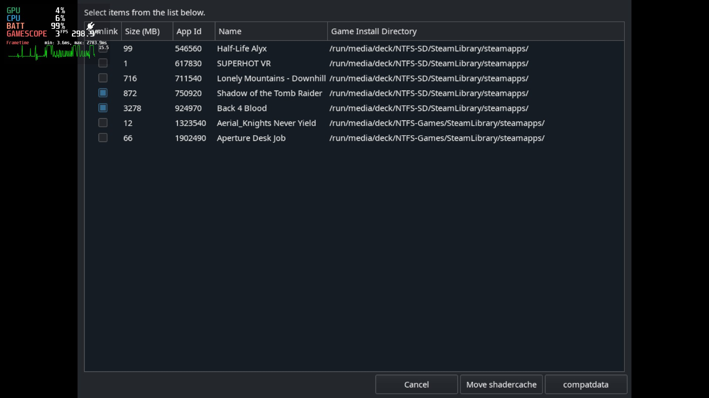

# Steam Deck: Shader Cache Killer

Script to Purge The Steam Decks Shader Cache & Compat Data

# Steam Deck: Shader Cache Mover

Script to Symlink selected games Shader Cache & Compat Data to the SD card or External Drive

## Problem

With the 64GB verson of the Steam Deck, "Other" can quicky fill your internal SSD even if you only store Games on the SD card, this "Other" is often `Shader Cache` & `CompatData`.

## Solution?

To free up some of the space you can delete the Shader Cache and/or the Compat(ability) Data, the `zShaderCacheKiller` script aims to make that process a little easier.

Rather than deleting the Shader Cache or the Compat Data, the `zShaderCacheMover` script will copy & symlink selected games Shader Cache & Compat Data to the SD card or External Drive that the game is stored, freeing up the Interal Storage.

## Is this safe?

This has had limited testing on one system, USE AT OWN RISK

## What results can I expect?

For me I has 16.2GB of "Other" data, running  `zShaderCacheKiller` dropped this down to ~7GB.

My Back 4 Blood install was also using 3.5GB of Shader Cache, this I did not want to remove, instead with `zShaderCacheMover`, these files are now on my much larger SD card. As I also duel boot with Windows 11, this also saves space as the Shader Cache is now in the same location on the SD card.

## How to use

## Video Guide

https://www.youtube.com/watch?v=SLGvTDGDUcY

## Run online Via Curl

In Konsole type `curl -sSL https://raw.githubusercontent.com/scawp/Steam-Deck.Shader-Cache-Killer/main/zShaderCacheKiller.sh | bash` to run `zShaderCacheKiller`

In Konsole type `curl -sSL https://raw.githubusercontent.com/scawp/Steam-Deck.Shader-Cache-Killer/main/zShaderCacheMover.sh | bash` to run `zShaderCacheMover`

## Install Via Curl

In Konsole type `curl -sSL https://raw.githubusercontent.com/scawp/Steam-Deck.Shader-Cache-Killer/main/curl_install.sh | bash`

The install script will offer to add `zShaderCacheKiller.sh` & `zShaderCacheMover.sh` to your Steam Libaray, which can be ran from `GameMode`. 

## Uninstall

To uninstall simply delete the install folder:

`sudo rm -r /home/deck/.local/share/scawp/SDSCK`

Also remove the `non-steam game` links in `Steam`

# Found a Bug?

Please add to the `issues` tab! https://github.com/scawp/Steam-Deck.Shader-Cache-Killer/issues

# "This is cool! How can I thank you?"
### Why not drop me a sub over on my youtube channel ;) [Chinballs Gaming](https://www.youtube.com/chinballsTV?sub_confirmation=1)

### Also [Check out all these other things I'm making](https://github.com/scawp/Steam-Deck.Tools-List)
