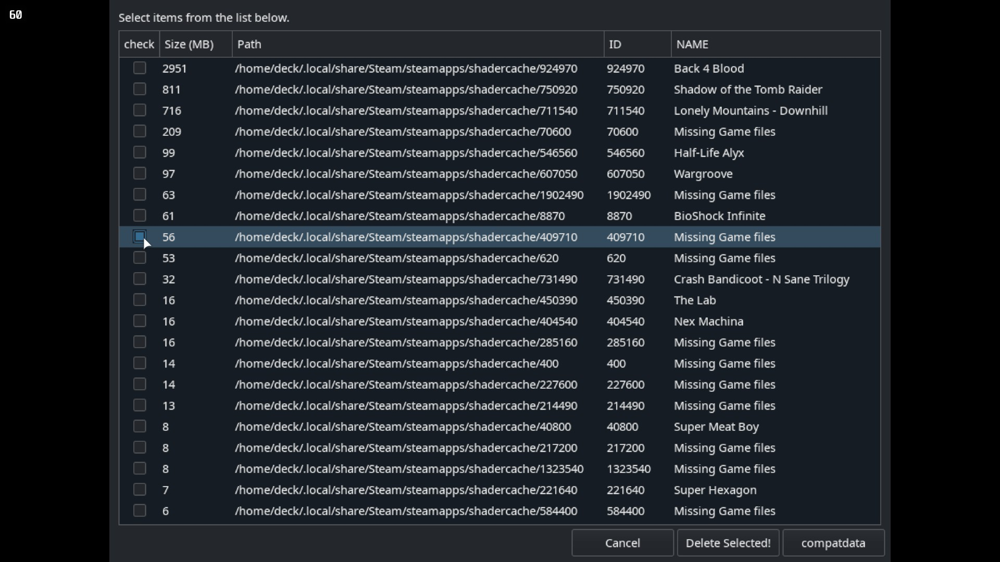

# Steam Deck: Shader Cache Killer

Script to Purge The Steam Decks Shader Cache/ Compat Data

## Problem

With the 64GB verson of the Steam Deck, "Other" can quicky fill your internal SSD even if you only store Games on the SD card.

For me this was a result of installing the same game several times on different SD cards which then prevented me from installing other games.

## Solution?

To free up some of the space you can delete the Shader Cache, this script aims to make that process a little easier.

## ~~Why not~~ Compdata also?

Yes if you click `compactdata`, be sure not to delete any Proton files. Games will probaby become unplayable!

~~I tested this and it broke all my Proton installs with no easy way to repair other than a Factory Reset, more research is required for other locations.~~

## Is this safe?

This has had limited testing on one system, USE AT OWN RISK

## What results can I expect?

For me I has 16.2GB of "Other" data, running this dropped this down to ~7GB

## How to use

## Run online Via Curl

In Konsole type `curl -sSL https://raw.githubusercontent.com/scawp/Steam-Deck.Shader-Cache-Killer/main/zShaderCacheKiller.sh | bash`

## Install Via Curl

In Konsole type `curl -sSL https://raw.githubusercontent.com/scawp/Steam-Deck.Shader-Cache-Killer/main/curl_install.sh | bash`

The install script will offer to install add `zShaderCacheKiller.sh` to your Steam Libaray for manual mounting and unmounting of Drives which can be ran from `GameMode`. 

icons and banner art provided in `steamArt` but currently need to be added manually.

# Found a Bug?

Please add to the `issues` tab! https://github.com/scawp/Steam-Deck.Shader-Cache-Killer/issues

# "This is cool! How can I thank you?"
### Why not drop me a sub over on my youtube channel ;) [Chinballs Gaming](https://www.youtube.com/chinballsTV?sub_confirmation=1)

### Also [Check out all these other things I'm making](https://github.com/scawp/Steam-Deck.Tools-List)
